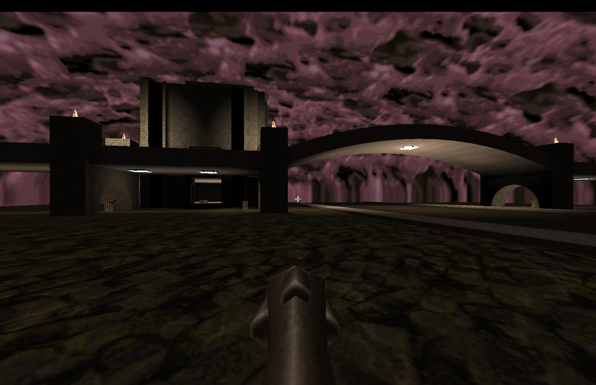

# quake-loyola

A Quake 1 deathmatch map inspired by the pedestrian bridge at Loyola University Maryland.



## Real-world reference

The map recreates the **pedestrian bridge over Charles Street** on Loyola University
Maryland's Evergreen campus in northern Baltimore (39°20′46″N, 76°37′08″W).

- **The bridge** spans east–west over North Charles Street, which runs north–south
  through the 79-acre campus. The real bridge features Collegiate Gothic arched
  stonework connecting the west and east sides of campus.
- **[Knott Hall](https://www.google.com/maps/search/Knott+Hall,+Loyola+University+Maryland,+Baltimore,+MD)** — formally the *Francis Xavier Knott, S.J. Knott Humanities Center* —
  is the oldest building on campus (1896). Originally a Tudor Revival private residence
  designed by Renwick, Aspinwall & Renwick for the Garrett family (heirs to the
  Baltimore & Ohio Railroad fortune), it was purchased by the Jesuits in 1921 and
  converted to academic use. The building sits east of Charles Street, south of the
  bridge.
- The campus was founded in 1852 and moved to its current "Evergreen" location in 1922.
  Notable alumni include Tom Clancy and Mark Bowden.

## Files

| File | Description |
|---|---|
| `loyola.map` | Map source (TrenchBroom / Quake 1 `.map` format) |
| `generate_map.py` | Python script that generates the `.map` from scratch |

## Terminology

Terms used when discussing the map's structure and the Python generator code.

### Bridge structure

| Term | Description |
|---|---|
| **Arch span** | The curved section of the bridge deck (PB_X1 to PB_X2, 1050 units). The deck surface follows a parabolic arch rising 106 units at the centre. |
| **Flat approach** | Straight deck sections extending from each end of the arch span to the world boundary. Deck sits at constant Z. |
| **Deck** | The walkable bridge surface. `dtop(x)` = top face Z; `dbot(x)` = bottom face Z. Deck slab thickness is 16 units. |
| **Arch rise** | How far the deck centre is raised above the endpoints (`PB_ARCH_RISE = 106` units ≈ 7 ft). |
| **Parapet** | Low stone wall running along the north and south edges of the deck, 32 units tall. Players can jump onto it. |

### Pier / pillar

| Term | Description |
|---|---|
| **Pier** | The full stone support structure rising from the ground to the bridge deck. Consists of an arch wall base, pillar post, and cap. |
| **Arch wall** | The lower stone mass of the pier (ground to deck underside). Contains the arch opening and is built from `arch_wall()`. |
| **Arch opening** | The semicircular hollow in the arch wall. Inner radius `rin` sets the opening size; outer radius `rout` sets the stone ring thickness. |
| **Arch ring** | The annular stone band surrounding the arch opening, composed of trapezoidal voussoir segments. |
| **Voussoir** | One wedge-shaped brush segment of the arch ring, generated by `arch_seg()`. |
| **Stilt height** | Straight vertical section below the arch spring point (`sprz`). Raises the arch opening above ground on tall piers. |
| **Arch crown** | The topmost point of the arch ring (`sprz + rout`). Should be flush with the deck underside (`dbot`). |
| **Cap** | Solid box filling the area above the arch inner crown and below the deck underside, bridging the gap in the centre of the opening. |
| **Pillar post** | Stone column above the deck surface, extending `PIL_EXTRA` units above the parapet. |
| **Overhang** | How far the pier stone extends beyond the bridge's N/S edges (`PIL_OVERHANG = 16` units). |

### Knott Hall

| Term | Description |
|---|---|
| **Mullion** | Vertical protruding cement post flanking a window opening on Knott Hall's north facade. Mullions sit just outside each window opening (not inside) so players can pass through. Width = 12 units, protrusion = 12 units. |
| **Recessed window** | Window set back in the NW or NE indented corner of the north facade. Each opening is 48 units wide, framed by mullions on the outer edges. |
| **Indentation** | 80-unit corner notch cut from the NW and NE corners of the north face, creating a recessed alcove with its own back wall and window. |


| Term | Description |
|---|---|
| **Teleport arch** | Decorative stone arch portal at each end of the bridge with a trigger field. West arch teleports to east; east to west. |
| **Post** | Straight vertical stone column on each side of a teleport arch opening. |

## Map layout

```
[West Campus] ──── bridge span ──── [Knott Hall]
              ↑arch              arch↑
      5 stone pillars supporting the span
```

- **Bridge span**: 1050-unit arched span (69.5 ft), deck at Z 128–144.
- **Entry arch gates**: Semicircular stone arch portals at each end (16 voussoir segments) with teleport fields.
- **Stone pillars**: 5 supporting piers (only 2 visible by default) with narrow arched openings.
- **Knott Hall**: A 4-story brutalist tower on the south campus, featuring vertical "fins" on its north facade.
- **Charles Street**: Road surface running N-S under the bridge.
- **Sky**: `sky1` ceiling, sealed outer box.

## Object relationships

This section describes how the map's major objects relate to each other — spatially, structurally, and via gameplay connections — to guide discussion of changes.

### Spatial hierarchy

Everything is enclosed in the **world shell** (floor + 4 walls + sky ceiling). Objects inside:

```
World shell
├── Charles Street (N–S road, runs full Y extent)
│   ├── West sidewalk & curb
│   ├── East sidewalk & curb
│   ├── South arch teleport gate  ──→ bridge deck centre
│   └── North arch teleport gate  ──→ bridge deck centre
├── Ennis Road (E–W road, T-junction north of bridge)
│   └── Ennis Drive entrance pillars & boundary wall
├── West campus buildings
│   ├── Abutment building (3-floor brick, west end of bridge)
│   ├── North building (gabled, north side of Ennis Road)
│   ├── South building 1 & South building 2
│   └── Iron fence (east face of west buildings)
├── Embankment (sloped ground ramp from road level up to bridge deck Z)
├── Bridge (E–W span over Charles Street, Z 208 → 320 at crown)
│   ├── Arch deck (32 segments PB_X1 → PB_X2, parabolic rise)
│   ├── Parapet walls (N & S edges, full span)
│   ├── Parapet blocks & handrails
│   ├── Stone piers ×5 (at PB_ARCH_X[] positions)
│   │   └── each: arch wall → voussoir ring → cap → pillar post
│   ├── West teleport arch (X = PB_X1 / west world wall)
│   └── East teleport arch (X = east world wall)
├── Walkway (flat slab, bridge east end → Knott Hall 2nd floor)
├── Knott Hall (south campus tower, X 1266–1906)
│   ├── Outer walls (5 floors + roof)
│   ├── Interior floors, hallway & rooms
│   ├── Elevator (func_plat) inside lift shaft
│   ├── Entrance staircase & railings (north face, ground level)
│   └── Fascia lettering ("LOYOLA UNIVERSITY MARYLAND")
└── Campus lamp posts (along Charles Street)
```

### Teleport connections

Each `trigger_teleport` brush points to an `info_teleport_destination` by `targetname`.

| Trigger location | `targetname` | Destination |
|---|---|---|
| West arch — deck level | `dest_east` | North building rooftop (west campus) |
| West arch — ground level | `dest_east` | North building rooftop (west campus) |
| East arch — deck level | `dest_west` | Knott Hall rooftop |
| East arch — ground level | `dest_east_deck` | Flat deck, just west of east arch |
| Abutment arch (Y = 0, deck) | `dest_abutment_deck` | Bridge deck above abutment pier |
| Charles St south arch gate | `dest_bridge_mid` | Bridge deck centre |
| Charles St north arch gate | `dest_bridge_mid` | Bridge deck centre |

### Structural dependencies

These constants are "load-bearing" across multiple objects; changing one cascades.

| Constant | Objects affected |
|---|---|
| `KH_FLOOR_H` | All Knott Hall floor Z levels, walkway alignment, spawn heights, weapon placement |
| `KH_X1/X2`, `KH_Y1/Y2` | Knott Hall footprint; moving it requires updating walkway, back road, hill terrain, east-arch teleport destination |
| `P_HW` | Pier post half-width; affects arch wall extents, cap size, overhang, and brick wall X positions |
| `PAR_H`, `PAR_W` | Parapet height and width; affects spawn Z, handrail positions, and pillar post base |
| `PB_ARCH_RISE` | Deck crown height; shifts pier heights per X, deck spawn Z, parapet-top Z |
| `PB_ARCH_X[]` | Pier X positions; `PB_ARCH_X[0]` pins the abutment building X |
| `PB_DZ1`, `PB_DZ2` | Flat deck Z, all pier heights, teleport arch spring height (`PB_DZ2 + ARCH_STILT`), walkway Z |
| `PB_X1`, `PB_X2` | Deck arch shape & segment count, all pier X range, teleport arch X positions, embankment ramp extents |
| `PB_Y1`, `PB_Y2` | Parapet N/S position, teleport arch Y opening size, walkway Y start, Ennis Road reference Y |
| `PIL_CAP_H`, `PIL_PYR_H`, `PIL_PYR_W` | Pier cap and pyramid dimensions; purely visual, no gameplay cascade |
| `PIL_EXTRA` | Extra pillar post height above parapet; affects how far piers protrude above deck |
| `PIL_OVERHANG` | How far pier stone extends beyond bridge N/S edges; affects parapet wall Y alignment |
| `RH_DEPTH` | Residence hall N–S depth; shared by all four RH buildings — changing it shifts the south building stack |
| `RH_EMB_X2` | East edge of the embankment ramp; set to keep the abutment pier stone base visible |
| `RH_FLOORS` | Residence hall floor count; shared by all four RH buildings |
| `RH_NORTH_Y1`, `RH_NORTH_Y2` | North building Y extents; derived from `WORLD_Y2`, shifts south building stack indirectly |
| `RH_PIER_X` | Derived from `PB_ARCH_X[0]`; pins the RH building X — move the west pier and the buildings move too |
| `RH_SOUTH1_Y1/Y2`, `RH_SOUTH2_Y1/Y2` | South building 1 & 2 Y extents; stacked directly — changing `RH_DEPTH` shifts both |
| `RH_WALL` | Wall thickness; used for all RH interior/exterior dimensions and window placement |
| `RH_WIN_HW`, `RH_WIN_HH` | Window half-width / half-height; shared across all RH building facades |
| `RH_X1`, `RH_X2` | RH building E–W extents; also anchor the embankment ramp split and the brick wall positions |
| `WORLD_X1/X2` | Derives `PB_X1`; resizing the world changes the arch span and all wall-relative positions |

### Gameplay flow

```
Charles Street  ──[south arch]──┐
                                 ├──→  Bridge deck centre
Charles Street  ──[north arch]──┘

Bridge west end ──[walk through arch]──→  West campus rooftop  ──(drop down)──→  ground
Bridge east end ──[walk through arch]──→  Knott Hall rooftop
Bridge east end ──[walkway]──────────→  Knott Hall 2nd floor
Knott Hall                            ──[lift (func_plat)]──→  Floors 1–5
```

## Textures required

All textures come from the community **quake101.wad** collection. Download **quake101.wad** and place it alongside the `.map` file before compiling.

| Surface | Texture name |
|---|---|
| Bridge deck | `sfloor3_2` |
| Stone pillars, arch | `city6_7` |
| Knott Hall walls | `tech03_1` |
| Road surface | `stone1_7` |
| Ravine floor | `rock1_2` |
| Sky surfaces | `sky1` |

## Entities

| Entity | Qty | Location |
|---|---|---|
| `info_player_deathmatch` | 14 | Scattered across bridge, campus, and hall |
| `weapon_rocketlauncher` | 4 | Bridge deck, Knott Hall (Floors 1 & 3), East campus |
| `item_health` | 3 | Bridge deck, Hall entrance, Hall 2nd floor |
| `light` | ~20 | Pillar caps, hall interior/exterior, road, and teleport arches |
| `func_plat` | 1 | Lift shaft inside Knott Hall |

## Compiling

You need **ericw-tools v0.18.1** or later: [github.com/ericwa/ericw-tools/releases](https://github.com/ericwa/ericw-tools/releases).  
Place `quake101.wad` in the same directory as the `.map` file, then:

```bash
# 1. BSP (geometry)
qbsp loyola.map

# 2. Visibility (inter-leaf vis — speeds up rendering significantly)
vis loyola.bsp

# 3. Lighting
light loyola.bsp
```

The compiled `loyola.bsp` goes in your Quake `id1/maps/` directory.

## Loading in Quake

```
quake -game id1 +map loyola
```

Or from the console:
```
map loyola
```

## Editing in TrenchBroom

TrenchBroom is pre-configured for this project. The following files are written to
TrenchBroom's app-support folder and are **not** committed to the repo (they reference
absolute paths on your machine):

| File | Location |
|---|---|
| Game path | `~/Library/Application Support/TrenchBroom/Preferences.json` |
| Compile profiles | `~/Library/Application Support/TrenchBroom/games/Quake/CompilationProfiles.cfg` |
| Engine profile | `~/Library/Application Support/TrenchBroom/games/Quake/GameEngineProfiles.cfg` |

### Game path (`Preferences.json`)

```json
{
    "Games/Quake/Path": "/Applications"
}
```

Points TrenchBroom at the directory that contains `id1/` (PAK files, WADs, compiled maps).

### Compile profiles (`CompilationProfiles.cfg`)

Both profiles use `${MAP_DIR_PATH}` as the working directory so ericw-tools picks up
`quake101.wad` from the same folder as the `.map` file.

**Full Build** — qbsp → vis → light → copy to `/Applications/id1/maps/`  
**Fast Build** — qbsp only → copy (quick geometry iteration)

Tool paths point to `~/Downloads/ericw-tools-v0.18.1-Darwin/bin/`.  
The compiled BSP is copied to `/Applications/id1/maps/` after each build.

### Engine profile (`GameEngineProfiles.cfg`)

Launches vkQuake with:

```
/Applications/vkQuake.app/Contents/MacOS/vkQuake -basedir /Applications +map ${MAP_BASE_NAME}
```

### Workflow

1. Open `loyola.map` in TrenchBroom (**File → Open**).
2. Edit brushes / entities as needed.
3. **Run → Compile Map** → choose *Full Build* or *Fast Build*.
4. **Run → Launch Engine** → choose *vkQuake* to test immediately.

## Regenerating the map

```bash
python3 generate_map.py
```

This rewrites `loyola.map` from scratch. Edit constants at the top of the script to change dimensions, arch radius, pillar count, etc.
