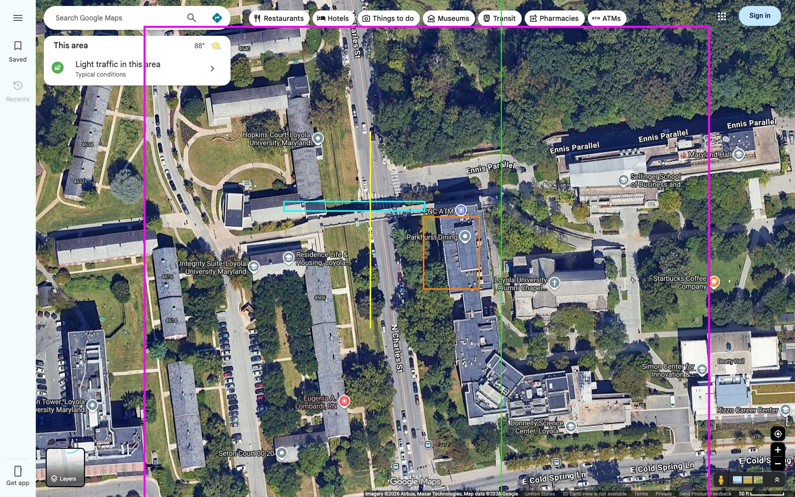
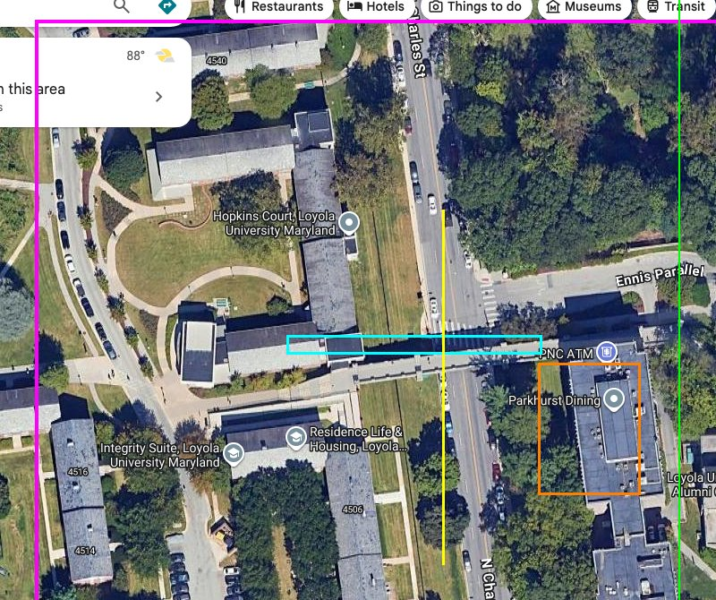

Map Reference
=============

Real-world reference
--------------------

The map recreates the **pedestrian bridge over Charles Street** on Loyola
University Maryland's Evergreen campus in northern Baltimore
(39°20′46″N, 76°37′08″W).

- **The bridge** spans east–west over North Charles Street, which runs
  north–south through the 79-acre campus. The real bridge features Collegiate
  Gothic arched stonework connecting the west and east sides of campus.
- **Knott Hall** — formally the *Francis Xavier Knott, S.J. Knott Humanities
  Center* — is the oldest building on campus (1896). Originally a Tudor Revival
  private residence designed by Renwick, Aspinwall & Renwick for the Garrett
  family (heirs to the Baltimore & Ohio Railroad fortune), it was purchased by
  the Jesuits in 1921 and converted to academic use. The building sits east of
  Charles Street, south of the bridge.
- The campus was founded in 1852 and moved to its current "Evergreen" location
  in 1922. Notable alumni include Tom Clancy and Mark Bowden.

Orientation
-----------

Quake's coordinate system is used as: **+X = east, +Y = north, +Z = up**
(confirmed against the module docstring of ``quake_loyola/constants.py``;
this corrects an earlier, incorrect "Y = south" statement in this project's
agent instructions).

Real-world N Charles St's actual compass bearing was measured by geocoding
two points ~4 km apart along the street (Cold Spring Ln and Bellona Ave via
OpenStreetMap/Nominatim) and computing the great-circle bearing between
them: **~354.5°** — i.e. Charles St runs almost due north, tilted only
~5.5° west of true north as it heads north. The map models Charles St as
running exactly along the Y-axis (0° tilt, ``ROAD_X1``/``ROAD_X2`` constant
across all Y). This ~5.5° discrepancy is an accepted simplification — close
enough not to warrant rotating the model, but noted here for future
reference. Google Maps satellite screenshots in ``ref/`` are standard
north-up captures (no in-app rotation), so image "up" corresponds to quake
+Y (north) throughout the pixel-measurement methodology below.

World scale
-----------

Quake units are converted to real-world feet via ``constants.SCALE = 15.108``
units per foot (``constants.ft_to_units(feet, inches)``). That works out to
**1 unit ≈ 0.79 inch** — close to, but not exactly, the "1 unit ≈ 1 inch"
rule of thumb used elsewhere in this project's documentation.

The world-shell rectangle (``WORLD_X1``/``WORLD_X2``/``WORLD_Y1``/``WORLD_Y2``
in ``constants.py``) was re-derived from pixel measurements against the
scale bars baked into the Google Maps screenshots in ``ref/`` (e.g.
``ref/gmaps-kh-satellite.png``'s 50 ft bar, ``ref/gmaps-campus-satellite-wide.png``'s
100 ft bar). Measuring from the west dorms' facade to Knott Hall's east
face/Ennis Parallel bend, and from Hopkins Court to E Cold Spring Ln, gives
an estimated real-world target footprint of:

- **~850 ft** east–west (X axis — dorms to Knott Hall/Ennis Parallel)
- **~710 ft** north–south (Y axis — Hopkins Court to E Cold Spring Ln)

These are rough estimates (±10–15%) from manual pixel-to-scale-bar
measurement, not a surveyed footprint. ``WORLD_X1``/``WORLD_X2``/``WORLD_Y1``/
``WORLD_Y2`` were scaled from their previous values to match this target
(X: -5135..7708 = 850 ft; Y: -6642..4085 = 710 ft), keeping Charles Street's
centerline at X=0. All other module geometry (bridge, dorms, Knott Hall,
terrain) is temporarily disabled via the master switches in ``constants.py``
(``BRIDGE_ENABLED``, ``WEST_CAMPUS_ENABLED``, ``KNOTT_TERRAIN_ENABLED``,
``KNOTT_HALL_ENABLED``, ``STREETS_DETAILS_ENABLED``, ``ENTITIES_ENABLED``)
while each area's own dimensions are re-derived against this new world size
from the ``ref/`` top-down views.

**Fixed anchors vs. the world rectangle.** Several modules' constants used to
be defined *relative to* ``WORLD_X1``/``WORLD_X2``/``WORLD_Y1``/``WORLD_Y2``
(e.g. ``BRIDGE_X1 = WORLD_X1 + WALL_T``, ``CHARLES_Y1 = WORLD_Y1 + WALL_T``).
When the world rectangle was enlarged to match the real-world footprint above,
that coupling would have silently stretched the bridge span, Charles Street,
and the Ennis Drive/east-campus features by the same ~2.4–2.6× factor as the
world — even though those spans were already reasonable real-world estimates
from the original (smaller) map and hadn't been re-measured. To avoid
introducing unreviewed distortion, these constants were repointed at their
own **fixed anchors** (plain numeric values equal to their pre-resize
computed value), decoupling them from ``WORLD_X1``/``WORLD_X2``/``WORLD_Y1``/
``WORLD_Y2``:

- ``BRIDGE_X1 = -1967`` (was ``WORLD_X1 + WALL_T``)
- ``CHARLES_Y1 = -2768``, ``CHARLES_Y2 = 1696``, ``DORM_NORTH_Y2 = 1546``
  (were ``WORLD_Y1 + WALL_T`` / ``WORLD_Y2 - WALL_T`` / ``WORLD_Y2 - WALL_T - 150``)
- ``_EAST_FEATURES_X2 = 2976`` (a new fixed anchor; was ``WORLD_X2``) — used
  for Ennis Drive/east-campus feature placement (teleport arch, gate, cement
  plaza) instead of the live, now much larger, ``WORLD_X2``

The **world-shell rectangle itself** (``streets.py``'s floor/walls/sky) still
spans the full ``WORLD_X1..WORLD_X2_EXT`` / ``WORLD_Y1..WORLD_Y2`` real-world
footprint — two additional plain sealing wall panels were added (north and
south walls, from ``WORLD_X1`` to ``BRIDGE.x1``) to seal the new gap between
the enlarged world boundary and the fixed-anchor bridge/tunnel geometry. The
space between the world boundary and these fixed anchors represents
unmodeled real estate (e.g. further west campus, further east of Ennis
Parallel) pending future re-derivation — it is not yet filled with terrain
or buildings.

.. note::
   ``bridge.py``, ``entities.py``, and ``knott_terrain.py`` still reference
   the live ``WORLD_X2_EXT`` internally for some of the same
   Ennis/east-campus features that ``_EAST_FEATURES_X2``/``_EAST_FEATURES_X2_EXT``
   now anchor in ``constants.py``. These modules are currently disabled via
   their master switches; when they're re-enabled, they should be repointed
   at the new fixed anchors so behavior matches the disabled-state geometry
   exactly, or explicitly re-derived if the intent is for them to reach the
   new world boundary.

World size validation
~~~~~~~~~~~~~~~~~~~~~~

To sanity-check the resized world rectangle and fixed anchors above, the
current ``constants.py`` values were converted back to pixel coordinates
(using the same ``SCALE``/pixel-per-foot conversion) and overlaid on
``ref/gmaps-kh-satellite.png``, anchored at the intersection of Charles
Street's centerline (``X=0``) and the bridge deck's centerline (``Y=0``):

         footprint overlaid on the satellite reference image
   :width: 100%

- **Magenta** — the world rectangle (``WORLD_X1..WORLD_X2``/``WORLD_Y1..WORLD_Y2``,
  850 × 710 ft). Comfortably spans from the Integrity Suite dorm (west) across
  Charles St to Ennis Parallel/Maryland Hall (east), and from just north of
  Hopkins Court south to E Cold Spring Ln.
- **Cyan** — the bridge deck (fixed ``BRIDGE_X1``/``BRIDGE_X2``). Lines up
  almost exactly with the real pedestrian bridge crossing.
- **Orange** — the Knott Hall footprint (``KNOTT_X1``/``KNOTT_X2``/``KNOTT_Y1``/``KNOTT_Y2``).
  Sits on the Parkhurst Dining/PNC ATM building at the bridge's east landing,
  covering roughly its northern half — the building continues south beyond
  this anchor (unmodeled, pending further re-derivation).
- **Yellow** — the modeled Charles St span (``CHARLES_Y1``/``CHARLES_Y2``),
  from Hopkins Court to Eugenia A. Lombardi RN.
- **Green** — the ``_EAST_FEATURES_X2`` anchor (Ennis Drive/east-campus
  feature placement), landing near the east edge of Ennis Parallel.

A closer crop of the bridge crossing confirms the alignment:

         bridge crossing Charles St
   :width: 100%

**Conclusion:** the current world size and fixed bridge/Charles St anchors
are a good match for the target area — several dorms (Hopkins Court,
Residence Life, Integrity Suite, Eugenia Lombardi, Seton Court), the bridge,
and Knott Hall's north half all fall within the world rectangle, with room
to spare toward Ennis Parallel and E Cold Spring Ln. No resize was needed as
a result of this check.

Charles St width validation
~~~~~~~~~~~~~~~~~~~~~~~~~~~~

Curb-to-curb width of N Charles St was measured at three rows in
``ref/gmaps-kh-satellite.png`` (chosen away from the bridge crossing and
parked cars), using RGB pixel sampling to find the road-surface/verge
boundary: 48px, 44px, and 52px, averaging **~35.8 ft** (35.8, 32.8, 38.8 ft
respectively; 0.7463 ft/px). This matches the existing ``ROAD_X1``/``ROAD_X2``
constant (``-256``/``256`` = 33.9 ft) well within measurement noise — no
change was needed. ``STREETS_DETAILS_ENABLED`` was re-enabled as the first
re-derived module (roads, sidewalks, curbs, lamps, trees, driveways, Ennis
entrance features); compiles with no leaks at the new world size.

Topology check
~~~~~~~~~~~~~~

Real-world elevation was sampled from the USGS 3DEP Elevation Point Query
Service (~1 m resolution) at pixel positions converted to lat/lon via the
established ft/px scale and Charles St's measured compass bearing
(~354.5°, see § Orientation), anchored at the Charles St & Cold Spring Ln
bus stop (39.3455°N, 76.6221°W).

**East–west cross-section at the bridge crossing** (baseline = the road
cut, the section's lowest point, ~296 ft):

- **West dorms** — a local hilltop peak ~120–150 ft from the west edge,
  **~+6.6 ft** above the road. Close to the existing ``SDORM_LIFT``
  (128 units = 8.47 ft) — a reasonable match.
- **Road / bridge crossing** — the lowest point of the section, as
  expected for a road running through a cut.
- **East side (Knott Hall → Ennis Parallel)** — starts **~+7.2 ft** right
  at Knott Hall's west edge, then climbs steadily to **~+21.7 ft** by
  Ennis Parallel, ~360 ft further east. The existing ``KNOTT_GROUND_Z``
  (64 units = 4.24 ft) **underestimates** this initial rise, and no
  constant currently models the continued eastward climb toward Ennis
  Parallel (that area is flat at ``FLOOR_Z2`` today).

**North–south grade along Charles St itself** — a bigger finding: the road
climbs **~40 ft over ~580 ft** (~6.7% grade) from the north end to the
south end of the modeled corridor. ``ROAD_Z`` is currently a flat constant
(``FLOOR_Z2 + 8``) and does not model this slope at all.

**Action items for future terrain/building re-derivation** (not yet
implemented — ``WEST_CAMPUS_ENABLED``, ``KNOTT_TERRAIN_ENABLED``,
``KNOTT_HALL_ENABLED`` remain disabled):

- Increase ``KNOTT_GROUND_Z`` to better match the measured ~+7 ft rise at
  Knott Hall's west edge.
- Consider modeling a continued eastward elevation gain toward Ennis
  Parallel, rather than a single flat plateau.
- Consider giving Charles St (and the bridge/floor it connects to) an
  overall north-south grade rather than a flat ``ROAD_Z``, if map fidelity
  warrants it — a substantial change affecting many downstream Z constants.

Terminology
-----------

Naming conventions
~~~~~~~~~~~~~~~~~~~

Constant names follow the pattern ``AREA_FEATURE_SUFFIX`` (e.g.
``BRIDGE_PILLAR_CAP_OVH`` = bridge pillar cap overhang). The full legend also
lives in the module docstring of :mod:`quake_loyola.constants`.

**Area prefixes:** ``BRIDGE_``, ``KNOTT_``, ``ENNIS_``, ``DORM_``,
``CHARLES_``, ``STREET_``, ``ROAD_``, ``WORLD_``, ``ARCH_``.

.. list-table::
   :header-rows: 1
   :widths: 20 80

   * - Suffix
     - Meaning
   * - ``X1``/``X2``, ``Y1``/``Y2``, ``Z1``/``Z2``
     - Min/max extent of a box along that axis (``1`` = lower coordinate,
       ``2`` = higher).
   * - ``DZ1``/``DZ2``
     - Bridge deck Z bottom / top.
   * - ``ZB``/``ZT``
     - Z bottom / Z top of a feature.
   * - ``CX``/``CY``
     - Centre X / centre Y of a feature.
   * - ``XS``/``YS``
     - A *list* (plural) of X or Y positions.
   * - ``N``/``S``/``E`` (e.g. ``NY``)
     - Compass direction (Quake: −Y = north, +Y = south, +X = east);
       ``NY`` = north-edge Y.
   * - ``H`` / ``HH``
     - Height / half-height.
   * - ``W`` / ``HW``
     - Width / half-width.
   * - ``T`` / ``R`` / ``D``
     - Thickness / radius / depth.
   * - ``OVH`` / ``EXTRA`` / ``PROUD``
     - Overhang / extra padding / how far a feature protrudes from its face.

.. list-table::
   :header-rows: 1
   :widths: 20 80

   * - Feature
     - Meaning
   * - ``PILLAR`` / ``BLK`` / ``SQ`` / ``PYR``
     - Pillar / block / square / pyramid.
   * - ``ENT`` / ``WIN`` / ``DIV`` / ``PLT`` / ``BR``
     - Entrance / window / road divider / platform / back road.
   * - ``DRIVEWAY_WS`` / ``_RD`` / ``_ES``
     - West-side / road / east-side sections of the Knott driveway
       (ordered west→east).
   * - ``BIY``
     - Knott building-interior Y (inner wall face).
   * - ``ORIG``
     - Original (pre-extension) reference, e.g. ``KNOTT_ORIG_CX``.
   * - ``KH``
     - Knott Hall (e.g. the ``FLOOR_KH`` texture).

Bridge structure
~~~~~~~~~~~~~~~~

.. list-table::
   :header-rows: 1
   :widths: 25 75

   * - Term
     - Description
   * - **Arch span**
     - The curved centre deck section over Charles Street, X ∈ [−525, +525]
       (``BRIDGE_ARCH_X[1]`` … ``BRIDGE_ARCH_X[2]``), a shallow parabola cresting
       at X=0. The two approach spans (±525 … ±1246) descend as straight rakes to
       the outer piers (ref/bridge08).
   * - **Flat approach**
     - Straight deck west of −1246, extending to the world wall at constant Z.
   * - **Deck**
     - The walkable surface. ``deck_top_z(x)`` = top face Z, ``deck_bot_z(x)`` =
       bottom face Z; slab thickness ``BRIDGE_DZ2 − BRIDGE_DZ1`` = 16 units.
   * - **Arch rise**
     - Height the deck crown is raised above the flat datum
       (``BRIDGE_ARCH_RISE = 100`` units at X=0, ``BRIDGE_ARCH_PIER_RISE = 82``
       at the centre piers).
   * - **Parapet**
     - Low stone wall along the deck's north/south edges,
       ``BRIDGE_PAR_H = 40`` units tall. Players can jump onto it.

Pier numbering
~~~~~~~~~~~~~~

The bridge has five piers, numbered west to east. This naming is used
consistently in the code (``PIER1_X`` … ``PIER5_X``).

.. list-table::
   :header-rows: 1
   :widths: 10 20 15 55

   * - Pier
     - Code constant
     - X position
     - Notes
   * - **Pier 1**
     - ``PIER1_X``
     - −1246
     - West abutment pier — embedded in the embankment hill; flanked by the
       abutment building.
   * - **Pier 2**
     - ``PIER2_X``
     - −525
     - Second pier west of centre.
   * - **Pier 3**
     - ``PIER3_X``
     - 525
     - Centre-east pier — anchors the Ennis Drive entrance pillars.
   * - **Pier 4**
     - ``PIER4_X``
     - 1246
     - West KH pier — marks the eastern end of the main arch span
       (``BRIDGE_X2 = KNOTT_PIER_X``).
   * - **Pier 5**
     - ``PIER5_X``
     - 2206
     - East KH / NE pier — easternmost pier, aligned with the Knott Hall east
       face; the bridge deck angles south from here. The accessible walkway
       runs along its west face.

Pier / pillar components
~~~~~~~~~~~~~~~~~~~~~~~~

.. list-table::
   :header-rows: 1
   :widths: 25 75

   * - Term
     - Description
   * - **Pier**
     - The full stone support structure rising from the ground to the bridge
       deck. Consists of an arch wall base, pillar post, and cap.
   * - **Arch wall**
     - The lower stone mass of the pier (ground to deck underside). Contains
       the arch opening; built from ``arch_wall()``.
   * - **Arch opening**
     - The semicircular hollow in the arch wall. Inner radius ``rin`` sets the
       opening size; outer radius ``rout`` sets the stone ring thickness.
   * - **Arch ring**
     - The annular stone band surrounding the arch opening, composed of
       trapezoidal voussoir segments.
   * - **Voussoir**
     - One wedge-shaped brush segment of the arch ring, generated by
       ``arch_seg()``.
   * - **Stilt height**
     - Straight vertical section below the arch spring point (``sprz``). Raises
       the arch opening above ground on tall piers.
   * - **Arch crown**
     - The topmost point of the arch ring (``sprz + rout``). Should be flush
       with the deck underside (``deck_bot_z``).
   * - **Cap**
     - Solid box filling the area above the arch inner crown and below the deck
       underside, bridging the gap in the centre of the opening.
   * - **Pillar post**
     - Stone column above the deck surface, extending ``BRIDGE_PILLAR_EXTRA``
       units above the parapet.
   * - **Overhang**
     - How far the pier stone extends beyond the bridge's N/S edges
        (``BRIDGE_PILLAR_OVERHANG = 16`` units).

Knott Hall
~~~~~~~~~~

.. list-table::
   :header-rows: 1
   :widths: 25 75

   * - Term
     - Description
   * - **Mullion**
     - Vertical protruding cement post flanking a window opening on Knott
       Hall's north facade. Mullions sit just outside each window opening (not
       inside) so players can pass through. Width = 12 units, protrusion = 12
       units.
   * - **Recessed window**
     - Window set back in the NW or NE indented corner of the north facade.
       Each opening is 48 units wide, framed by mullions on the outer edges.
   * - **Indentation**
     - 80-unit corner notch cut from the NW and NE corners of the north face,
       creating a recessed alcove with its own back wall and window.
   * - **Walkway bent**
     - The cement support structure under the bridge approach in front of Knott
       Hall. Consists of a horizontal cap beam running along the south bridge
       edge (Pier 4 → Pier 5) with 5 vertical drop piers reaching to ground
       level. Only present when ``KNOTT_WALKWAY_ENABLED = True``.
   * - **Accessible walkway**
     - The small N-S cement path running along the west face of Pier 5, from
       the Knott Hall north face up to the bridge south edge. A short E-W ramp
       at the north end wraps around Pier 5 and connects to the back-road west
       sidewalk. Generated alongside the main walkway when
       ``KNOTT_WALKWAY_ENABLED = True``.

Street / road
~~~~~~~~~~~~~

.. list-table::
   :header-rows: 1
   :widths: 25 75

   * - Term
     - Description
   * - **Verge**
     - The strip of land between the road edge and the sidewalk. In the real
       world this is often grass; here it is a raised ground-textured slab flush
       with the sidewalk height.
   * - **Teleport arch**
     - Decorative stone arch portal at each end of the bridge with a trigger
       field. West arch teleports to east; east to west.
   * - **Post**
     - Straight vertical stone column on each side of a teleport arch opening.
   * - **Lintel**
     - The horizontal beam spanning the top of an opening (door, window, or
       portal), resting on the two vertical posts.

Map layout
----------

.. code-block:: text

   [West Campus] ──── bridge span ──── [Knott Hall]
                 ↑arch              arch↑
         5 stone pillars supporting the span

- **Bridge span**: arched deck over Charles Street, crown at X=0; deck top
  ranges Z 240 (flat approach) → 384 (crown).
- **Entry arch gates**: Semicircular stone arch portals at each end with
  teleport fields.
- **Stone pillars**: 5 supporting piers with narrow arched openings.
- **Knott Hall**: A 5-story tower on the south campus, featuring
  vertical "fins" on its north facade.
- **Charles Street**: Road surface running N-S under the bridge.
- **Sky**: ``sky1`` ceiling, sealed outer box.

Spatial hierarchy
~~~~~~~~~~~~~~~~~

.. code-block:: text

   World shell
   ├── Charles Street (N–S road, runs full Y extent)
   │   ├── West sidewalk & curb
   │   ├── East sidewalk & curb
   │   ├── South arch teleport gate  ──→ bridge deck centre
   │   └── North arch teleport gate  ──→ bridge deck centre
   ├── Ennis Road (E–W road, T-junction north of bridge)
   │   └── Ennis Drive entrance pillars & boundary wall
   ├── West campus buildings
   │   ├── Abutment building (3-floor brick, west end of bridge)
   │   ├── North building (gabled, north side of Ennis Road)
   │   ├── South building 1 & South building 2
   │   └── Iron fence (east face of west buildings)
   ├── Embankment (sloped ground ramp from road level up to bridge deck Z)
   ├── Bridge (E–W span over Charles Street, deck top Z 240 → 384 at crown)
   │   ├── Arch deck (span segments BRIDGE_X1 → BRIDGE_X2, parabolic rise)
   │   ├── Parapet walls (N & S edges, full span)
   │   ├── Stone piers ×5 (at BRIDGE_ARCH_X[] positions)
   │   │   └── each: arch wall → voussoir ring → cap → pillar post
   │   ├── West teleport arch (X = BRIDGE_X1 / west world wall)
   │   └── East teleport arch (X = east world wall)
   ├── Walkway (flat slab, bridge east end → Knott Hall 2nd floor)
   │   ├── Walkway bent (cap beam + 5 drop piers)
   │   └── Accessible walkway (N-S path along Pier 5 + E-W ramp)
   ├── Knott Hall (south campus tower, X 1206–2238)
   │   ├── Outer walls (5 floors + roof)
   │   ├── Interior floors, hallway & rooms
   │   ├── Elevator (func_plat) inside lift shaft
   │   ├── Entrance staircase & railings (north face, ground level)
   │   └── Fascia lettering ("LOYOLA UNIVERSITY MARYLAND")
   └── Campus lamp posts (along Charles Street)

Teleport connections
~~~~~~~~~~~~~~~~~~~~

.. list-table::
   :header-rows: 1
   :widths: 35 25 40

   * - Trigger location
     - ``targetname``
     - Destination
   * - West arch — deck level
     - ``dest_east``
     - North building rooftop (west campus)
   * - West arch — ground level
     - ``dest_east``
     - North building rooftop (west campus)
   * - East arch — deck level
     - ``dest_west``
     - Knott Hall rooftop
   * - East arch — ground level
     - ``dest_east_deck``
     - Flat deck, just west of east arch
   * - Abutment arch (Y = 0, deck)
     - ``dest_abutment_deck``
     - Bridge deck above abutment pier
   * - Charles St south arch gate
     - ``dest_south_dorm_roof``
     - South dorm A-frame ridge
   * - Charles St north arch gate
     - ``dest_dorm_roof``
     - North dorm A-frame ridge
   * - Ennis east arch (east world wall)
     - ``dest_kh_drive_south``
     - Knott Hall rooftop
   * - Knott driveway arch
     - ``dest_ennis_east``
     - Knott Hall rooftop

Structural dependencies
~~~~~~~~~~~~~~~~~~~~~~~

These constants are "load-bearing" across multiple objects; changing one
cascades.

.. list-table::
   :header-rows: 1
   :widths: 30 70

   * - Constant
     - Objects affected
   * - ``CHARLES_CRN_R``, ``CHARLES_CRN_SEGS``
     - Charles/Ennis and Knott back-road corner radii / arc tessellation.
   * - ``CHARLES_RAMP_W``
     - Charles Street sidewalk ramp width; affects the east/west curb ramps.
   * - ``CHARLES_WALK_H``, ``CHARLES_WALK_W``
     - Charles Street sidewalk height/width; cascade into Ennis curbs, the
       Ennis wall setback, fence placement, Knott Hall terrain ramps, and
       the back-road sidewalks.
   * - ``CHARLES_Y1``, ``CHARLES_Y2``
     - Charles Street south/north extents; anchor road surface, sidewalk/fence
       spans, embankment ends, and north/south street arch teleports.
   * - ``KNOTT_FLOOR_H``
     - All Knott Hall floor Z levels, walkway alignment, spawn heights, weapon
       placement.
   * - ``KNOTT_PIER_X``
     - Fixed Knott Hall-side bridge pier; anchors ``BRIDGE_X2``,
       ``BRIDGE_ARCH_X[3]``, and east lamp placement.
   * - ``KNOTT_X1/X2``, ``KNOTT_Y1/Y2``
     - Knott Hall footprint; moving it requires updating walkway, back road,
       hill terrain, east-arch teleport destination.
   * - ``BRIDGE_ARCH_RISE``
     - Deck crown height; shifts pier heights per X, deck spawn Z,
       parapet-top Z.
   * - ``BRIDGE_ARCH_X[]``
     - Pier X positions; ``BRIDGE_ARCH_X[0]`` pins the abutment building X.
   * - ``BRIDGE_DZ1``, ``BRIDGE_DZ2``
     - Flat deck Z, all pier heights, teleport arch spring height, walkway Z.
   * - ``BRIDGE_PILLAR_HW``
     - Pier post half-width; affects arch wall extents, cap size, overhang,
       and brick wall X positions.
   * - ``BRIDGE_Y1``, ``BRIDGE_Y2``
     - Parapet N/S position, teleport arch Y opening size, walkway Y start,
       Ennis Road reference Y.
   * - ``DORM_FLOORS``
     - Dormitory floor count; shared by all west-campus residence buildings.
   * - ``WORLD_X1/X2``
     - Derives ``BRIDGE_X1``; resizing the world changes the arch span and all
       wall-relative positions.

Textures
--------

All textures come from the community WADs. Download ``quake101.wad``,
``ad.wad``, and ``makkon_building.wad`` and place them alongside the ``.map``
file before compiling (``just setup`` downloads the first two automatically).
Names below are the ``Textures.*`` constants in :mod:`quake_loyola.constants`.

.. list-table::
   :header-rows: 1
   :widths: 45 30 25

   * - Surface
     - ``Textures`` field
     - Texture name
   * - Bridge deck, stone, cement
     - ``FLOOR`` / ``STONE`` / ``CEMENT``
     - ``sfloor3_2``
   * - Pillars, arches, walls
     - ``PILLAR`` / ``WALL``
     - ``city2_7``
   * - Building facades
     - ``BUILDING``
     - ``city2_1``
   * - Brickwork
     - ``BRICK``
     - ``bricka2_1``
   * - Ground / embankment
     - ``GROUND``
     - ``ground1_1``
   * - Road surface
     - ``ROAD``
     - ``azfloor1_1``
   * - Roofs
     - ``ROOF``
     - ``roofkell1``
   * - Sky surfaces
     - ``SKY``
     - ``sky1``

Entities
--------

.. list-table::
   :header-rows: 1
   :widths: 35 10 55

   * - Entity
     - Qty
     - Location
   * - ``info_player_deathmatch``
     - 22
     - Scattered across bridge, campus, and hall.
   * - ``weapon_rocketlauncher``
     - 19
     - Bridge deck, Knott Hall floors, and campus.
   * - ``item_health``
     - 14
     - Bridge deck, hall entrance, and hall floors.
   * - ``light``
     - ~480
     - Pillar caps, hall interior/exterior, road, and teleport arches.
   * - ``func_plat``
     - 1
     - Lift shaft inside Knott Hall.

Loading and editing
-------------------

Loading in Quake
~~~~~~~~~~~~~~~~

.. code-block:: text

   quake -game id1 +map loyola

Or from the in-game console:

.. code-block:: text

   map loyola

Manual compilation (without just)
~~~~~~~~~~~~~~~~~~~~~~~~~~~~~~~~~~

Download **ericw-tools v0.18.1** from
`github.com/ericwa/ericw-tools/releases <https://github.com/ericwa/ericw-tools/releases>`_
and place ``quake101.wad``, ``ad.wad``, and ``makkon_building.wad`` alongside
the ``.map`` file, then:

.. code-block:: bash

   qbsp loyola.map
   vis loyola.bsp
   light loyola.bsp

The compiled ``loyola.bsp`` goes in your Quake ``id1/maps/`` directory.

TrenchBroom
~~~~~~~~~~~

TrenchBroom is pre-configured for this project. The following files are
written to TrenchBroom's app-support folder and are **not** committed to the
repo (they reference absolute paths on your machine):

.. list-table::
   :header-rows: 1
   :widths: 30 70

   * - File
     - Location
   * - Game path
     - ``~/Library/Application Support/TrenchBroom/Preferences.json``
   * - Compile profiles
     - ``~/Library/Application Support/TrenchBroom/games/Quake/CompilationProfiles.cfg``
   * - Engine profile
     - ``~/Library/Application Support/TrenchBroom/games/Quake/GameEngineProfiles.cfg``

Set the game path in ``Preferences.json``:

.. code-block:: json

   {
       "Games/Quake/Path": "/Applications"
   }

Both compile profiles use ``${MAP_DIR_PATH}`` as the working directory so
ericw-tools picks up ``quake101.wad`` from the same folder as the ``.map``
file.  Tool paths point to
``~/Downloads/ericw-tools-v0.18.1-Darwin/bin/``.

**Workflow**: open ``loyola.map`` → edit → **Run → Compile Map** → **Run →
Launch Engine** (vkQuake).
